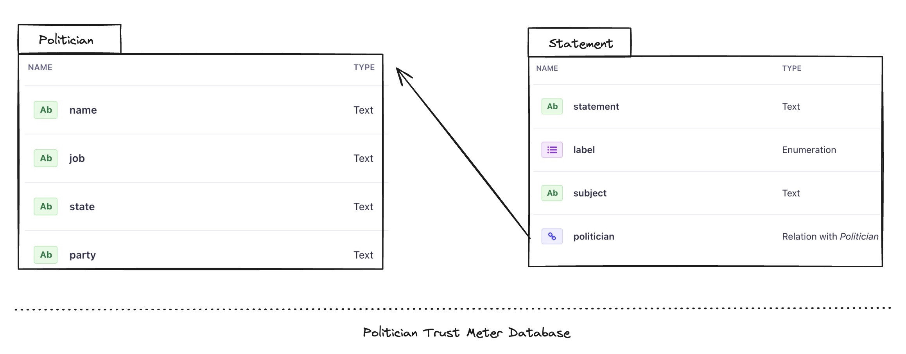

# Table of Contents

- [TLDR;](#tldr)
- [Prereqs and assumptions](#prereqs-and-assumptions)
- [So what's the problem?](#so-whats-the-problem)
- [Sidebar: GraphqQL in Strapi: a look under the hood](#graphqql-in-strapi-a-look-under-the-hood)
- [Customize application GraphQL schema](#customize-application-graphql-schema)
- [Putting it all together](#putting-it-all-together)
- [Conclusion](#conclusion)

## TLDR;

In this post we will modify the GraphQL schema that Strapi generates to include a new custom type and extend the existing type to include a new field. The whole project is on [Github](https://github.com/callmephilip/strapi-custom-graphql/tree/main); the main extension code is [here](https://github.com/callmephilip/strapi-custom-graphql/blob/main/src/index.ts#L15-L53)

## Prereqs and assumptions

- you have worked on a Strapi based project before
- you have used GraphQL APIs and understand terms like `schema`, `resolver`
- (kind of optional but helpful) you have written SQL queries before and are comfortable with `INNER JOINS` and `aggregations`

## So what's the problem?

Let's say we are building an API for Politician Trust Meter, giving us stats on how trustworthy a given politician is based on his/her previous track record. We got our hands on [LIAR dataset](https://huggingface.co/datasets/liar) hosted on Hugging Face. Here's the dataset summary:

> LIAR is a dataset for fake news detection with 12.8K human labeled short statements from politifact.com's API, and each statement is evaluated by a politifact.com editor for its truthfulness. The distribution of labels in the LIAR dataset is relatively well-balanced: except for 1,050 pants-fire cases, the instances for all other labels range from 2,063 to 2,638. In each case, the labeler provides a lengthy analysis report to ground each judgment.

After some cosmetic merging and processing, we load the dataset into Strapi. We end up with the following database schema:



We can now run queries to get a specific politician alongside some additional data. We can also find statements associated with a given politician. Front end folks come to us with the following sketch of the interface


How can we tweak our current schema to include stats for every politician based on their statements? What if we could extend `Politician` object to include dynamically calculated stats without changing the underlying data structure and keep things nice and normalized. Our goal is to produce a graphql schema that would look smth like this:

```graphql
type PoliticianHonestyStat {
  label: ENUM_STATEMENT_LABEL!
  count: Int!
}

type Politician {
  name: String!
  job: String
  state: String
  party: String
  createdAt: DateTime
  updatedAt: DateTime
  stats: [PoliticianHonestyStat!]
}
```

Turns out we can do it in Strapi! But before we jump in, let's look under the hood and see how Strapi handles GraphQL.

## GraphqQL in Strapi: a look under the hood

Once you add `graphql` plugin to your Strapi project, you ✨ automagically ✨ get all your content APIs exposed via `/grapqhl` endpoint - you get types, queries, mutations. Strapi does all the heavy lifting behind the scenes using [GraphQL Nexus](https://nexusjs.org/).

In GraphQL Nexus, you define your GraphQL schema in code using `js/ts` as opposed to using [GraphQL SDL](https://www.digitalocean.com/community/tutorials/graphql-graphql-sdl). Here's [an example](https://nexusjs.org/docs/getting-started/tutorial/chapter-writing-your-first-schema#model-the-domain)

```ts
import { objectType } from "nexus";

export const Post = objectType({
  name: "Post", // <- Name of your type
  definition(t) {
    t.int("id"); // <- Field named `id` of type `Int`
    t.string("title"); // <- Field named `title` of type `String`
    t.string("body"); // <- Field named `body` of type `String`
    t.boolean("published"); // <- Field named `published` of type `Boolean`
  },
});
```

As you can see, writing these schemas is a pretty tedious task, so it's great that Strapi takes care of it. However, `graphql` plugin does expose additional APIs allowing us to tap into the underlying Nexus machine to customize application GraphQL schema. Let's see how!

## Customize application GraphQL schema

Let's get back to our app. Here are the tasks we need to go through to roll a new schema:

- define `PoliticianHonestyStat` that includes aggregated stats
- extend `Politician` object to include a list of stats of type `PoliticianHonestyStat`
- define resolver logic to pull stats for a given politician from the database

But first, how do we get hold of Nexus inside Strapi? We do so using `extension` service exposed by `graphql` plugin:

```ts
const extensionService = strapi.plugin("graphql").service("extension");

extensionService.use(({ nexus, strapi }: { nexus: Nexus; strapi: Strapi }) => {
  return {
    types: [
      // we will return new types
      // and extend existing types here
    ],
  };
});
```

We will begin by declaring a new type called `PoliticianHonestyStat` containing 2 fields: `label` and `count`. Notice how `label` is typed as `ENUM_STATEMENT_LABEL`, which was generated by Strapi for Enum field belonging to `Statement` content type. Our definition looks as follows:

```ts
nexus.objectType({
  name: "PoliticianHonestyStat",
  definition(t) {
    t.nonNull.field("label", {
      type: "ENUM_STATEMENT_LABEL",
    });
    t.nonNull.int("count");
  },
}),
```

Next up, extending `Politician` object type to include a list of our newly crafted `PoliticianHonestyStat`:

```ts
nexus.extendType({
    type: "Politician",
    definition(t) {
    t.list.field("stats", {
        type: nonNull("PoliticianHonestyStat"),
        resolve: async (parent) => {
            // XX: shortcut!!!
            // let's leave this empty for now,
            // we'll get back here in a minute
            return [];
        },
    });
    },
}),
```

If we now inspect GraphQL schema generated by our app (you can use your local GraphiQL instance at [http://localhost:1337/graphql](http://localhost:1337/graphql)), we will be able to locate 2 following definitions:

```graphql
type PoliticianHonestyStat {
  label: ENUM_STATEMENT_LABEL!
  count: Int!
}

type Politician {
  name: String!
  job: String
  state: String
  party: String
  createdAt: DateTime
  updatedAt: DateTime
  stats: [PoliticianHonestyStat!]
}
```

We can even go ahead and run a query to test things out:

```graphql
query {
  politicians {
    data {
      id
      attributes {
        name
        party
        stats {
          label
          count
        }
      }
    }
  }
}
```

Which gives back smth like this:

```json
{
  "data": {
    "politicians": {
      "data": [
        {
          "id": "1",
          "attributes": {
            "name": "rick-perry",
            "party": "republican",
            "stats": []
          }
        },
        {
          "id": "2",
          "attributes": {
            "name": "katrina-shankland",
            "party": "democrat",
            "stats": []
          }
        },
        {
          "id": "3",
          "attributes": {
            "name": "donald-trump",
            "party": "republican",
            "stats": []
          }
        }
        /* more stuff here*/
      ]
    }
  }
}
```

So this kinda works but the stats are just not there. Remember that little shortcut from above? Well, it's time to fix it:

```ts
nexus.extendType({
    type: "Politician",
    definition(t) {
    t.list.field("stats", {
        type: nonNull("PoliticianHonestyStat"),
        resolve: async (parent) => {
            // XX: shortcut!!!
            return [];
        },
    });
    },
}),
```

There are at least a couple of ways to handle this. We could use Strapi's entity service API to pull stats for a given politician and then do some math adding things up, OR we could leverage Strapi's raw database handle and write some sweet sweet SQL to count things for us:

```ts
nexus.extendType({
  type: "Politician",
  definition(t) {
    t.list.field("stats", {
      type: nonNull("PoliticianHonestyStat"),
      resolve: async (parent) => {
        // parent points to the instance of the Politician entity
        const { id } = parent;

        return strapi.db.connection.raw(`
            SELECT COUNT(statements.id) as "count", statements.label
            FROM politicians
            INNER JOIN statements_politician_links ON statements_politician_links.politician_id = politicians.id
            INNER JOIN statements ON statements.id = statements_politician_links.statement_id
            WHERE politicians.id = ${id}
            GROUP BY statements_politician_links.politician_id, statements.label
        `);
      },
    });
  },
});
```

This little bit of SQL exposes some other Strapi's internals around database schema. Without getting into too many details that are beyond the scope of this article, let's take a quick look at what is happening.

> You can look at the database for your local app by opening `data.db` inside `.tmp` directory in the root of the project using your favorite SQLite client

There are 3 tables of interest for us here: `politicians`, `statements` and `statements_politician_links`. The first 2 are pretty straightforward, as they map directly to the collections we have defined in our app. The 3rd table, `statements_politician_links`, connects Politicians and Statements collection together, it has 2 fields (not counting its primary key ID); one of them points to the `politician` table while the other one points to `statement` telling us which statement belongs to which politician.

Given this schema and some INNER JOIN and GROUP BY kung fu, we are able to pull all statements for a given politician, group them by label and then count how many statements per label we have.

## Putting it all together

Let's head to `index.ts` in `/src` and put the whole thing together:

```ts
import type { Strapi } from "@strapi/types";
import type * as Nexus from "nexus";
import { nonNull } from "nexus";

type Nexus = typeof Nexus;

export default {
  /**
   * An asynchronous register function that runs before
   * your application is initialized.
   *
   * This gives you an opportunity to extend code.
   */
  register({ strapi }) {
    const extensionService = strapi.plugin("graphql").service("extension");
    extensionService.use(
      ({ nexus, strapi }: { nexus: any; strapi: Strapi }) => {
        return {
          types: [
            nexus.extendType({
              type: "Politician",
              definition(t) {
                t.list.field("stats", {
                  type: nonNull("PoliticianHonestyStat"),
                  resolve: async (parent) => {
                    const { id } = parent;

                    return strapi.db.connection
                      .raw(`SELECT COUNT(statements.id) as "count", statements.label
                    FROM politicians
                    INNER JOIN statements_politician_links ON statements_politician_links.politician_id = politicians.id
                    INNER JOIN statements ON statements.id = statements_politician_links.statement_id
                    WHERE politicians.id = ${id}
                    GROUP BY statements_politician_links.politician_id, statements.label`);
                  },
                });
              },
            }),
            nexus.objectType({
              name: "PoliticianHonestyStat",
              definition(t) {
                t.nonNull.field("label", {
                  type: "ENUM_STATEMENT_LABEL",
                });
                t.nonNull.int("count");
              },
            }),
          ],
        };
      }
    );
  },

  async bootstrap({ strapi }) {
    // some stuff here
  },
};
```

Let's go ahead and test this using America's 45th president as an example:

```grahql
query {
  politicians(filters: { name: { eq: "donald-trump" } }) {
    data {
      id
      attributes {
        name
        party
        stats {
          label
          count
        }
      }
    }
  }
}
```

Which gives:

```json
{
  "data": {
    "politicians": {
      "data": [
        {
          "id": "3",
          "attributes": {
            "name": "donald-trump",
            "party": "republican",
            "stats": [
              {
                "label": "barely_true",
                "count": 63
              },
              {
                "label": "half_true",
                "count": 51
              },
              {
                "label": "lie",
                "count": 117
              },
              {
                "label": "mostly_true",
                "count": 37
              },
              {
                "label": "pants_fire",
                "count": 61
              },
              {
                "label": "truth",
                "count": 14
              }
            ]
          }
        }
      ]
    }
  }
}
```

## Conclusion

In this post, we presented a use case for extending existing GraphQL schema that you might encounter in your Strapi projects. We discovered how Strapi integrates GraphQL in its stack and how we can work with it to modify data layout to suit our use case. You can find the codebase for the project on [Github](https://github.com/callmephilip/strapi-custom-graphql/tree/main) and take it for a spin locally.
